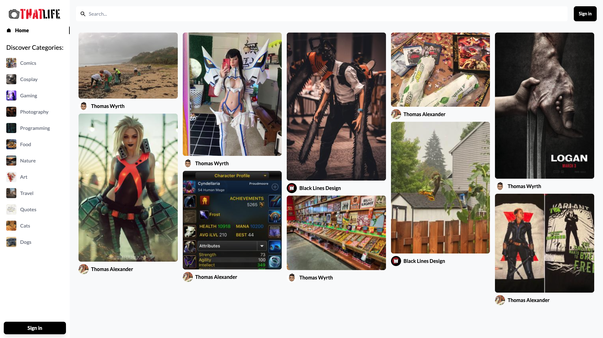
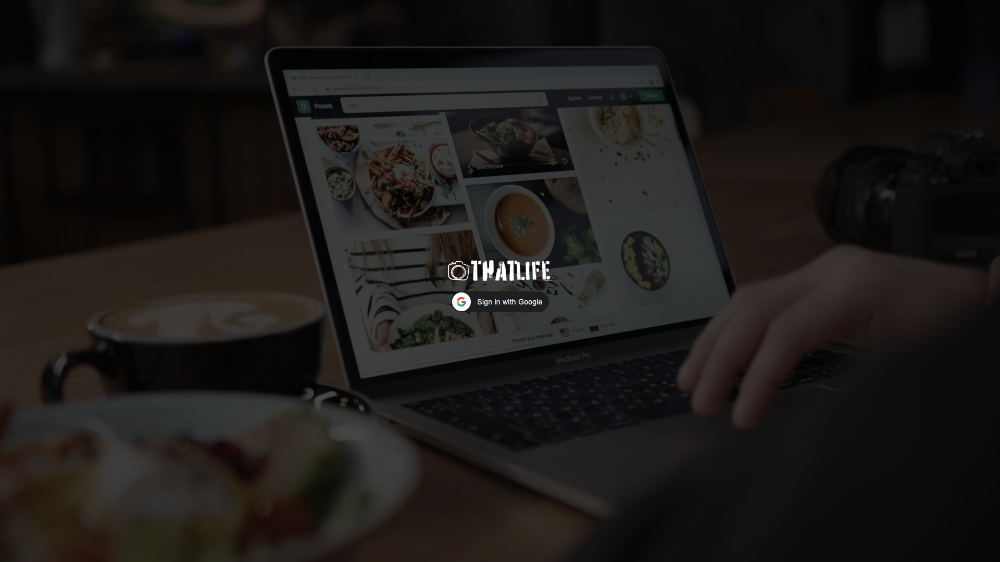
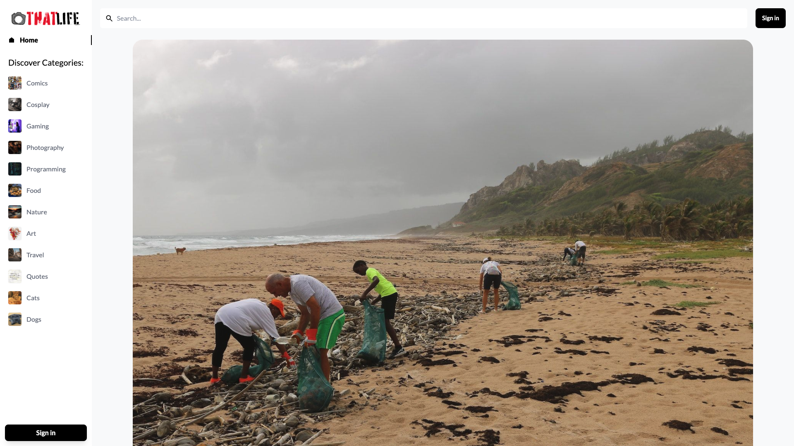

# thatLife

Photo-blogging social app — browse a masonry feed, search categories, save pins, and leave comments.

**Live demo:** [https://thatlifefrontend.vercel.app](https://thatlifefrontend.vercel.app)  
**Walkthrough:** [YouTube](https://youtu.be/nyRdGQK1P0A)





## Features

- Masonry image feed with category browse and search
- Google sign-in for posting, saving, and commenting (guests can browse)
- Pin detail pages with related pins
- Sanity-backed content (images, users, likes, comments)



## Stack

| Layer | Tech |
| --- | --- |
| Frontend | React 18, Vite, Tailwind CSS, React Router |
| Auth | Google Identity Services (`@react-oauth/google`) |
| Backend / CMS | Sanity Studio v3 + Sanity Content Lake |
| Hosting | Vercel (SPA + `/api/query` + `/api/mutate` proxies) |

## What I changed vs the tutorial

This started from a JavaScript Mastery ShareMe-style Sanity tutorial. Notable differences:

- Google Identity Services login (newer GIS flow) instead of the older Google button package
- Route/auth adjustments so visitors can browse without signing in
- Production Sanity reads/writes go through same-origin Vercel API proxies to avoid CORS friction
- Sanity Studio migrated from v2 → v3 (`sanity.config.js`, `defineType` schemas)
- Portfolio hygiene: `.env` removed from git, `.env.example` added

Learning / prototype scope — not a production multi-tenant product.

## Setup

### Prerequisites

- Node.js 18+ (22 recommended)
- A [Sanity](https://www.sanity.io/manage) project
- A Google OAuth Web Client ID

### Frontend

```bash
cd thatlife_frontend
cp .env.example .env
# fill VITE_GOOGLE_API_TOKEN, VITE_SANITY_PROJECT_ID, VITE_SANITY_TOKEN
npm install
npm run dev
```

### Sanity Studio

```bash
cd thatlife_backend
npm install
npm run dev
```

Studio opens at the URL printed in the terminal (usually `http://localhost:3333`).

### Environment variables

See [`thatlife_frontend/.env.example`](thatlife_frontend/.env.example).

For local browser access to Sanity, add `http://localhost:5173` (and your preview origin) under **API → CORS origins** in the Sanity project settings. Production uses `/api/query` so it does not depend on Sanity CORS for reads.

## Security note

An older commit tracked `thatlife_frontend/.env` (including a Sanity write token and a Google client secret that does not belong in a Vite app). Those values should be treated as compromised:

1. Rotate the Sanity API token in [manage.sanity.io](https://www.sanity.io/manage)
2. Rotate / recreate the Google OAuth client credentials
3. Keep secrets out of git — only `.env.example` is committed

## License

UNLICENSED — personal portfolio project.
