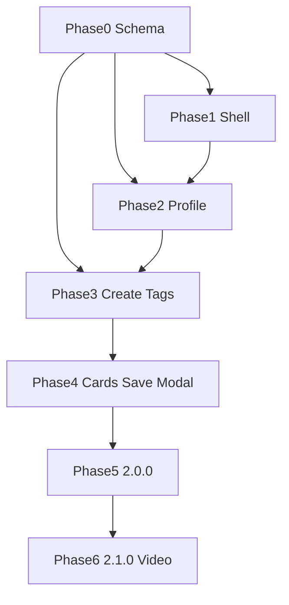

# thatLife v2.0.0 — ordered implementation path

Build order after the UI modernization assessment and [`UI_TWEAKS.md`](UI_TWEAKS.md) (#1–#13).  
Ship still-image / nav / profile / cards / modal in **2.0.0**. Video = **schema hooks only** now; full video feature = **2.1.0**.

**Product version:** both packages are at **2.0.2** (Phase 0 + dark mode + collapsible sidebar). Tag **2.1.0** when video upload/playback ships; use further **2.0.x** patches as remaining UI path items land if preferred.

Hand-coding entry point: [`PHASE0_SCHEMA_HANDOFF.md`](PHASE0_SCHEMA_HANDOFF.md) (**done**).

---

## Phase 0 — Schema foundation — `done`

Extend Sanity schemas (Studio v3) without breaking existing documents.

| Change | Schema | Supports |
| --- | --- | --- |
| `bio`, `profileComplete`, `notifyOnLike`, `notifyOnComment`, optional `theme` | `user` | #1, #2, #3, #13 |
| `allowDownload` (default true) | `pin` | #7 |
| `tags` (`string[]`), optional `altText` | `pin` | #8, #12 |
| `mediaType`, optional `video` file, poster/thumbnail (**hooks only**) | `pin` | #11 → 2.1.0 |

Update GROQ in [`thatlife_frontend/src/utils/data.js`](../thatlife_frontend/src/utils/data.js) only when a Phase 1+ UI needs a new field (not required for video until 2.1.0).

---

## Phase 1 — App shell

| Order | Item | Notes |
| --- | --- | --- |
| 1 | **#3** Dark mode | **done** — [`PHASE1_DARK_MODE_HANDOFF.md`](PHASE1_DARK_MODE_HANDOFF.md) |
| 2 | **#4** Categories + icons | **done** — Movies/Books/Celebrities + `react-icons` in sidebar |
| 3 | **#5** Collapsible sidebar | **done** — Main / Discover / Account; icons-only collapse; `/about` |
| 4 | **#6** User menus | Shared menu: User’s Page / Profile / Sign off in sidebar + navbar |

Add routes/pages as needed: `/about`, `/profile` (or `/settings`).

---

## Phase 2 — Profile

| Order | Item | Notes |
| --- | --- | --- |
| 5 | **#1** Editable profile | Username, avatar upload, notification toggles; wire `/api/mutate` + `/api/asset` |
| 6 | **#13** Bio | Field + public profile display + edit on #1 |
| 7 | **#2** First login → profile | Gate on `profileComplete` / first-run; then home feed |

---

## Phase 3 — Create + discovery content

| Order | Item | Notes |
| --- | --- | --- |
| 8 | **#7** Post options | Optional URL; `allowDownload`; strip-metadata when workable (**images only**) |
| 9 | **#12** Tags | Create Pin tags input; show on detail (and cards in Phase 4) |

No video create/feed work in this phase (deferred to 2.1.0).

---

## Phase 4 — Feed & detail UX

| Order | Item | Notes |
| --- | --- | --- |
| 10 | **#8** Pin card redesign | Title/tags footer; remove always-on username |
| 11 | **#9** Optimistic save | No `window.location.reload()` |
| 12 | **#10** Pin detail modal | md+ modal over feed; mobile full page; shareable URL |

---

## Phase 5 — Release 2.0.0

1. Smoke: guest browse, Google login, profile edit, create pin (image), save, comment, dark mode, sidebar, menus, modal  
2. Bump versions to **2.0.0**, update README, commit, tag `v2.0.0`, deploy  

---

## Phase 6 — Release 2.1.0 (video)

1. Create UI for short video + duration/size caps  
2. Feed tile playback (muted hover/tap) + detail player  
3. Extend `/api/asset` (or dedicated route) for video uploads  
4. Tag **2.1.0**

---

## Dependency graph (high level)

---

## Out of scope for 2.0.0

- ATProto OAuth, lexicons, AppView  
- Follower graph, handles as social graph  
- Notification email/push delivery (prefs only)  
- Video upload, playback, or create/feed branching (schema hooks only)  
